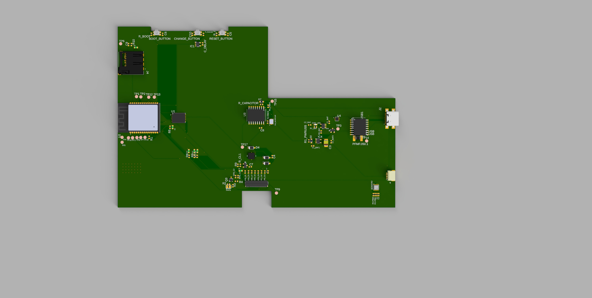

# 📘 OpenBook Reader  
**Autor:** Andrei-Valerian Andreescu  
**Grupa:** 335CC  

## 🔧 Diagrama bloc

---

## 📦 Bill of Materials (BOM)

| Componenta | Link                 | Datasheet |
|------------|----------------------|-----------|
| 112ATAARR03ATTEND | [Link](https://store.comet.srl.ro/Catalogue/Product/43497/) | [Link](https://store.comet.srl.ro/Catalogue/Product/43497/) |
| EAGLE-LTSPICE_C0402 | [Link](https://componentsearchengine.com/part-view/CC0402MRX5R5BB106/YAGEO) | [Link](https://analytics.supplyframe.com/trackingservlet/track/?r=0x34EY99PS_gIu2qWuzU9_U842M9-un2szqNoXX0OQ9lqbiEKGN3BJ73jgvlrgiXR89Peb0evqc4GXoUXllBhmj4gJdLuEy14MI9SrNEq4NAjHZw7EMo6H_mmw_5v5T3l9JVrQfTeeAGaxgFGYIu23YBGAL2uoNdiaC9H1iPNaL1pAgze1HZwySGIaVntCe8evYTetZvHUr2i7oUyPyMJa1PdtSpW1re7v-7kKtr_uM-x3U-6L9TyIp4U2hjL_bPvL2fXxseBVtIjcnJFpiGY1GX-neAeGfGLjn6nJU58m_9lxmVBhibi6qYEAuQaKVZcaNPt35daYQ32WAbWbiAyPnedue41899V_fM0WMiPmHaDSwwQb5g2l8dCcNuFpX1rD8gmaC_j5AOkfgubvd_7k_wKk7CLnDbp-3dzdzkWWh5vwXgFGsp0_tlKyyvi9qjevYTetZvHUr2i7oUyPyMJZDsIqXdFh1HxhfUSNjMzhPGydOsztjgDAv6FhGlATxNfUfg4ta07U9FPBs_Y3BRuSELfSvHltz3TmK1K6jgVejMkekGmSC0_ijKL1YfE8BE) |
| ESP32_WROVER_EAGLE-LTSPICE_R0402 | [Link](https://componentsearchengine.com/part-view/R0402%201%25%20100%20K%20(RC0402FR-07100KL)/YAGEO) | [Link](https://analytics.supplyframe.com/trackingservlet/track/?r=0x34EY99PS_gIu2qWuzU9_U842M9-un2szqNoXX0OQ9lqbiEKGN3BJ73jgvlrgiXR89Peb0evqc4GXoUXllBhmj4gJdLuEy14MI9SrNEq4Otd6HouwDNkBJ6EbvJG_W1dvQ33O37oQvrBIGmAmWf7WaTE1x7V-fhYVb8BzYSgNk10lRrx9ydF05rSu_yF-RcTLzrvVqKpyEMsu1tWML3F5NsDK3eYvMDWLFReFpcpYcQT6VJIIHxe2IkeuwFaNGGth_bPArqAVRLfjMYZDlSoV5_e61wrdrMeBLi53h3S0fpxDEX4TLvuLsi8JJGhgQx2voMmyqY6gjXW05FuTS5Qg0wN73a4RXBC7fJniBn8yrQ7EOV9V6YTQbMQN7mWZOa9Qu4n49CFU27OfkFATs7tGn6BEkuItjL7Idd3BXJuwnVh9XKLNAcLs6QXtjq7jDCdksoFiwKXmoFw3sFOj5NXQ-qxHSTVt4wudAEtK25Wb5CzEczgqDfXEQesLsiJT4-XFNfgt7LRuH9NmM38ieQHEqyxGFi6kd4X6I0KTHQLg2-V8XlyekPtBCU8gDdPBhOQ17Oj7rYC0lA0EcA__td0qxqTJ8t7VxJcv7gPOP6anfgCpsnupcmJj6zFPjIrtqj4NWwwbbecRBKOv7doyTdwmzqoyGGrGPY7DQKSHciWg8cX6Hc3D7dmNS4mPEOJOOKewle43KybI4UJMP_UcC5JA) |
| MYBUTTON | [Link](https://industry.panasonic.com/global/en/products/control/switch/light-touch/number/evqpuj02k) | [Link](https://industry.panasonic.com/global/en/downloads?tab=catalog&small_g_cd=203&part_no=EVQPUJ02K) |
| XCVR_ESP32-C6-WROOM-1-N8 | [Link](https://www.snapeda.com/parts/ESP32-C6-WROOM-1-N8/Espressif+Systems/view-part/?ref=eda) | [Link](https://www.snapeda.com/parts/ESP32-C6-WROOM-1-N8/Espressif%20Systems/datasheet/) |
| SON127P600X800X80-9N | [Link](https://www.snapeda.com/parts/W25Q512JVEIQ/Winbond+Electronics/view-part/) | [Link](https://www.snapeda.com/parts/W25Q512JVEIQ/Winbond%20Electronics/datasheet/) |
| DIOC1608X36N | [Link](https://www.snapeda.com/parts/PGB1010603MR/Littelfuse/view-part/?ref=eda) | [Link](https://www.snapeda.com/parts/PGB1010603MR/Littelfuse%20Inc./datasheet/) |
| IND_4828-WE-TPC_WRE | [Link](https://ro.mouser.com/ProductDetail/Wurth-Elektronik/744043680?qs=PGXP4M47uW6VkZq%252BkzjrHA%3D%3D) | [Link](https://www.we-online.com/components/products/datasheet/744043680.pdf) |
| FH34SRJ24S05SH99 | [Link](https://componentsearchengine.com/part-view/FH34SRJ-24S-0.5SH(99)/Hirose) | [Link](https://analytics.supplyframe.com/trackingservlet/track/?r=0x34EY99PS_gIu2qWuzU9_U842M9-un2szqNoXX0OQ9lqbiEKGN3BJ73jgvlrgiXR89Peb0evqc4GXoUXllBhmj4gJdLuEy14MI9SrNEq4Na1-SZQ6io_Dy0P2b_FE2c1FbYLbBmtObGfB8XBVxQ9NUqbCPPnKu9xG9naJOta7dtyhm9jleOdoMvP9MuRAq85y_RnX4Hoe5RXYxRK1qJmoAwKPAa-h5AhXLQ2SZ-GypS3vStAWpiQ-hlpQNtW_k3jZZivXO0uv1niF39bzAWz15k6DRYKJPPzdbbKwcElfhLXX2glnu-z5CdYnX21tTtQnj1M1sN-KMZlymTDOWRLjposQUeJGq9H1aiRBGbyOMtcqfK9j-RJD9jxQS2FlpbdkeEX_Gv0dOk0XJ7bcTST4y4NPbWB8Y_OlWHZultm4AFaxDjXn-W7_MKeUvXYRvFUs18SDNBveTlQgXZjtSujW9wdl6OCmEyApSMpTrxJccIpZzZDSt_pOcRi7PSAjdjnJk5GGln3KYOxN3Em6YeGbjzHXjtwLXVovtyhuM6e6aUTZJ8c4ODG-NIxh0uhh2NiScqep17qvTwnJG7pQnxHSR6-2eSgXb3qFP3Jk0Oamw51BA5ruLDXxwczn9SmJ5bdh_kmzVEzIYo-AC-eZSsATCGXGVdSG6xD-426NhvEuEMAbaV38zTsp9-yW33MfKdT1jG9GmrFT05L5jjcx_uNUVnPJfzFJkQQSyWQHz11OM) |
| SOIC127P1032X265-16N | [Link](https://www.snapeda.com/parts/DS3231SN%23/Analog+Devices/view-part/) | [Link](https://www.snapeda.com/parts/DS3231SN%23/Analog%20Devices/datasheet/) |
| ESP32_WROVER_AVX---SD0805S020S1R0_AVX_SD0805S020S1R0_0 | [Link](https://ro.mouser.com/ProductDetail/KYOCERA-AVX/SD0805S020S1R0?qs=jCA%252BPfw4LHbpkAoSnwrdjw%3D%3D) | [Link](https://ro.mouser.com/datasheet/2/40/schottky-3165252.pdf) |
| CAPCP3225X100N | [Link](https://www.snapeda.com/parts/CPH3225A/Seiko+Instruments/view-part/?ref=eda ) | [Link](https://www.snapeda.com/parts/CPH3225A/Seiko%20Instruments/datasheet/) |
| SOD3716X135N | [Link](https://www.snapeda.com/parts/MBR0530/Onsemi/view-part/?ref=eda ) | [Link](https://www.snapeda.com/parts/MBR0530/ON%20Semiconductor/datasheet/) |
| SAMACSYS_PARTS_USB4110GFA | [Link](https://componentsearchengine.com/part-view/USB4110-GF-A/GCT%20(GLOBAL%20CONNECTOR%20TECHNOLOGY)) | [Link](https://analytics.supplyframe.com/trackingservlet/track/?r=0x34EY99PS_gIu2qWuzU9_U842M9-un2szqNoXX0OQ9lqbiEKGN3BJ73jgvlrgiXR89Peb0evqc4GXoUXllBhmj4gJdLuEy14MI9SrNEq4PoCi89ZctA4-kDp3BQhkXpH2DzsdO0BvVNaNDstYgXoJP31ecBQz8TbvXGeDXm6lLlGaktv_ZGcnQDXY_Jm4l7qTzZoYvrcDuK6DczS8PHjvO_sLMu5UeAZ8GC7ci13apB0YMahqYRJzrQKert1kdW90QfLJiqmEa800fLodTIaw6Y6Er8Udb1Qer9oaUT73TaFmB8MsiRKXE5jRR6AYn2zFTZF0fPrL7PxB_Kklxep3kiCFXNWAQKBXmrUw8YRg9tbRf3EeHwJSoZTlUkLiK1ZJ03gZGQlx_tFu7buLUD3cKwxt-NL4Q595A7224xsugtkbEFPk8oOxSGJ_LHYAQAbZcxjTr7-0B2gfKUc0nIgMhHQ1ZmsU-U87OSIrunF4mGuvL05dMNyqXJqtC-uoX003WGaG4kTFpIgyyEskwr4Y4nNs8v65MrOUj8A-o40EQUWDLttvT4qqUpxJw-bbM4kRSPfo2732k6xYzg6g3hilNI54QjTTZUTrptu4llLV6PJk0aGL94xR41d5EEcOY3) |
| JST04_1MM_RA | [Link](https://eu.mouser.com/ProductDetail/Adafruit/4208?qs=PzGy0jfpSMtbScLbr0L5dw==) | [Link](https://analytics.supplyframe.com/trackingservlet/track/?r=0x34EY99PS_gIu2qWuzU9_U842M9-un2szqNoXX0OQ9lqbiEKGN3BJ73jgvlrgiXR89Peb0evqc4GXoUXllBhmj4gJdLuEy14MI9SrNEq4PoCi89ZctA4-kDp3BQhkXpH2DzsdO0BvVNaNDstYgXoJP31ecBQz8TbvXGeDXm6lLlGaktv_ZGcnQDXY_Jm4l7qTzZoYvrcDuK6DczS8PHjvO_sLMu5UeAZ8GC7ci13apB0YMahqYRJzrQKert1kdW90QfLJiqmEa800fLodTIaw6Y6Er8Udb1Qer9oaUT73TaFmB8MsiRKXE5jRR6AYn2zFTZF0fPrL7PxB_Kklxep3kiCFXNWAQKBXmrUw8YRg9tbRf3EeHwJSoZTlUkLiK1ZJ03gZGQlx_tFu7buLUD3cKwxt-NL4Q595A7224xsugtkbEFPk8oOxSGJ_LHYAQAbZcxjTr7-0B2gfKUc0nIgMhHQ1ZmsU-U87OSIrunF4mGuvL05dMNyqXJqtC-uoX003WGaG4kTFpIgyyEskwr4Y4nNs8v65MrOUj8A-o40EQUWDLttvT4qqUpxJw-bbM4kRSPfo2732k6xYzg6g3hilNI54QjTTZUTrptu4llLV6PJk0aGL94xR41d5EEcOY3) |
| SOT95P280X120-5N | [Link](https://componentsearchengine.com/part-view/XC6220A331MR-G/Torex) | [Link](https://analytics.supplyframe.com/trackingservlet/track/?r=0x34EY99PS_gIu2qWuzU9_U842M9-un2szqNoXX0OQ9lqbiEKGN3BJ73jgvlrgiXR89Peb0evqc4GXoUXllBhmj4gJdLuEy14MI9SrNEq4OB_3F6n5b2GpxjFkeCFGxjIjl2pAOVy2zcoQGQxuo036k82aGL63A7iug3M0vDx44b9y4q5Rgkc_UTcoUbz-EFKm35u_Pt-UF5-Qq6wcvjqqlBMb2f4RZCO7jxguRPFrgtzlu-fR4ingqEGNbtkagfz41QUwP5IAPMsNYDiuGlQNSLtTFV0kh1szLCiB3HKoSHN3rnb6_rtbfq8mtA1qRv_Bln0SGRQRi7Gb6appE-IutRHO-iiQDAGdEN5g0TatgyYZy0U3E7be-mkvV0tzN-Yga1x68e32CNZt8xWLj3NfJVDOHS8ZS42zhawi9DWA1aRL3hvdnRcB352G10IL46169qwDsBVTcBHABUmJOZLUiFPAKnU5dw3RkOVJIhv6hb0GJ6_iu4F4MNWLmP2ofARWc8l_MUmRBBLJZAfPXU4w) |
| ESP32_WROVER_BME680_PSON80P300X300X100-8N | [Link](https://www.snapeda.com/parts/BME680/Bosch/view-part/?welcome=home) | [Link](https://www.snapeda.com/parts/BME680/Bosch%20Sensortec/datasheet/) |
| ESP32C6_VARISTOR_CT/CN1812 | [Link](https://www.mouser.co.uk/ProductDetail/EPCOS-TDK/B72520T0350K062?qs=dEfas%2FXlABIszF52uu7vrg%3D%3D ) | [Link](https://www.tdk-electronics.tdk.com/inf/75/db/CTVS_14/Surge_protection_series.pdf) |
| SOT95P280X145-6N | [Link](https://www.snapeda.com/parts/USBLC6-2SC6Y/STMicroelectronics/view-part/?ref=eda ) | [Link](https://www.snapeda.com/parts/USBLC6-2SC6Y/STMicroelectronics/datasheet/) |
| RCL_CT3528 | [Link](https://www.snapeda.com/parts/TAJB475K025RNJ/AVX/view-part/?t=capacitor%203528&con_ref=None) | [Link](https://www.snapeda.com/parts/TAJB475K025RNJ/AVX/datasheet/) |
| SON50P200X200X80-9N | [Link](https://www.snapeda.com/parts/MAX17048G+T10/Analog+Devices/view-part/?ref=eda ) | [Link](https://www.snapeda.com/parts/MAX17048G+T10/Analog%20Devices/datasheet/) |
| ESP32_WROVER_SPARKFUN-DISCRETESEMI_SOT23-3 | [Link](https://componentsearchengine.com/part-view/DMG2305UX-7/Diodes%20Incorporated ) | [Link](https://analytics.supplyframe.com/trackingservlet/track/?r=0x34EY99PS_gIu2qWuzU9_U842M9-un2szqNoXX0OQ9lqbiEKGN3BJ73jgvlrgiXR89Peb0evqc4GXoUXllBhmj4gJdLuEy14MI9SrNEq4NtqjPHN9-H5PBy53yJrrJZbBH4NAdcIMgEdV_gE1O6mVpxBjQq-HnrRVl4ju3mUj1MvOu9WoqnIQyy7W1YwvcX9VCRJhgRdTTXzdu_kskJxI7qHOaJ0KNYNdgDqe7ulUDDBYEvyQzFh2GA3-28PfZUrgL3V_Lp9QnbJWkRGpsoatDsQ5X1XphNBsxA3uZZk5r1C7ifj0IVTbs5-QUBOzu0afoESS4i2Mvsh13cFcm7CdWH1cos0BwuzpBe2OruMMJ2SygWLApeagXDewU6Pk1dDGTbLbAKyu3oEfdCvlBEQkLMRzOCoN9cRB6wuyIlPj5cU1-C3stG4f02YzfyJ5AcSrLEYWLqR3hfojQpMdAuDb5XxeXJ6Q-0EJTyAN08GE5IU7v-fDrD_q-Vag1rwTbBavWRcsShwa_HGaTwIgGWIRKUZFpYTAm1NA4_5an7HefUXWkuoQm8jiWo1ELn1nvqewle43KybI4UJMP_UcC5JA) |
| ESP32_WROVER_SPARKFUN-IC-POWER_SOT23-5 | [Link](https://ro.mouser.com/ProductDetail/Microchip-Technology/MCP73831T-2ACI-OT?qs=yUQqVecv4qvbBQBGbHx0Mw%3D%3D) | [Link](https://ro.mouser.com/datasheet/2/268/MCP73831_Family_Data_Sheet_DS20001984H-3441711.pdf) |
| ADAFRUIT_CHIP-LED0603 | [Link](https://www.snapeda.com/parts/KP-1608SURCK/Kingbright/view-part/?ref=search&t=LED%200603) | [Link](https://www.snapeda.com/parts/KP-1608SURCK/Kingbright/datasheet/) |
| SOT65P210X110-3N | [Link](https://www.snapeda.com/parts/SI1308EDL-T1-GE3/Vishay+Siliconix/view-part/) | [Link](https://www.snapeda.com/parts/SI1308EDL-T1-GE3/Vishay%20Siliconix/datasheet/) |

---

## Descriere detaliata a functionalitatii hardware

### Componente si interfete

Proiectul utilizeaza urmatoarele componente principale:

- **ESP32-C6 WROOM**: Microcontroller principal ce gestioneaza comunicarea, procesarea datelor si interfatarea tuturor componentelor.
- **Display E-Ink Waveshare 1.5”**: Se conecteaza prin interfata SPI la ESP32, afisand informatii precum ora, data, temperatura si alte notificari.
- **SD Card Reader**: Conectat prin SPI pentru stocarea si accesarea datelor suplimentare.
- **USB-C & Charger MCP73832**: Gestioneaza incarcarea bateriei LiPo si furnizeaza alimentare stabila catre sistem.
- **Baterie LiPo**: Alimentare portabila pentru intregul sistem.
- **Senzor BME688**: Conectat prin I2C, monitorizeaza temperatura, umiditatea si calitatea aerului.
- **RTC DS3231SN**: Conectat prin I2C, mentine timpul real si data exacta chiar si fara alimentare principala.
- **Butoane GPIO**: Reset, Boot si Change pentru diverse functii si moduri operationale ale ESP32.

### Specificatii de comunicatie

- **SPI**: Utilizata pentru Display-ul E-Ink si modulul SD Card.
- **I2C**: Pentru senzorul BME688 si RTC DS3231SN.
- **GPIO**: Pentru butoane si semnale auxiliare (reset, boot).
- **USB**: Conexiune USB-C pentru incarcare si eventuala comunicare de date cu PC-ul.

### Calcul energie

- ESP32-C6: Consum activ aproximativ 100-160 mA la 3.3V
- Display E-Ink: Consum in timpul actualizarii ~15 mA, consum aproape zero in idle.
- Senzor BME688: Consum mediu 0.9 mA
- RTC DS3231SN: Consum mediu 0.2 mA
- Modul incarcare MCP73832 si circuite auxiliare: consum variabil in functie de incarcarea bateriei.

Total mediu estimat in functionare normala: ~150-200 mA la 3.3V (in actualizare), consum idle redus considerabil.

---

## Detaliere pini ESP32-C6

| Pin ESP32-C6 | Functie           | Motivatie |
|--------------|-------------------|-----------|
| GPIO1 (TX)   | UART Debug        | Comunicare seriala pentru debugging si update firmware. |
| GPIO2        | SPI MOSI Display  | Pin dedicat SPI, necesar transferului rapid de date catre display. |
| GPIO3        | SPI CLK Display   | Semnal de ceas necesar sincronizarii datelor SPI. |
| GPIO4        | SPI CS Display    | Controlul selectarii dispozitivului SPI. |
| GPIO5        | SPI MISO SD Card  | Primire date de pe SD card. |
| GPIO6        | SPI MOSI SD Card  | Trimitere date catre SD card. |
| GPIO7        | SPI CLK SD Card   | Ceas sincronizare SPI pentru SD card. |
| GPIO8        | SPI CS SD Card    | Selectarea dispozitivului SPI SD Card. |
| GPIO10,11    | I2C SDA, SCL      | Protocol standard pentru comunicarea cu senzorii BME688 si RTC. |
| GPIO12       | Buton Reset       | Reset hardware rapid si usor accesibil. |
| GPIO13       | Buton Boot        | Control mod bootloader ESP32. |
| GPIO14       | Buton Change      | Interactiune utilizator pentru modificarea setarilor si navigare. |

---

## Imagini relevante

- Imagini relevante:

  - **PCB Randare**: 
  - **Carcasa si PCB (fara capac si baterie)**: 
  - **Display frontal**: 
  - **Vedere carcasa din fata**: 
  - **Carcasa deschisa**:  
